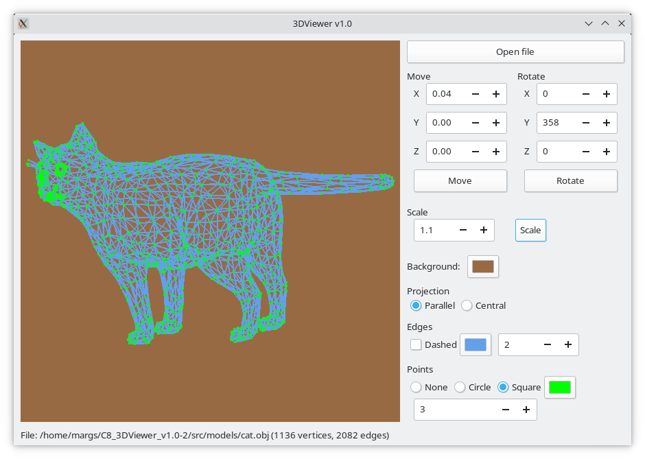

## 3dViewerGtkC
В данном проекте разработана программа для визуализации каркасной модели в трехмерном пространстве. Каркасная модель - модель объекта в трёхмерной графике, представляющая собой совокупность вершин и рёбер, которая определяет форму отображаемого многогранного объекта в трехмерном пространстве.  Модели загружаются из файлов формата .obj. Их возможно просматривать на экране с возможностью вращения, масштабирования и перемещения. Применяются собственные матрицы афинных преобразований (вращения, масштабирования и перемещения).
### Интерфейс

### Реализация
- Программа разработана на языке Си стандарта C11 с использованием компилятора gcc
- Сборка программы настроена с помощью Makefile со стандартным набором целей для GNU-программ: all, install, uninstall, clean, dvi, dist, tests, gcov_report. Установка производится в каталог build в директории проекта
- Программа разработана в соответствии с принципами структурного программирования
- Код соответствует Google Style
- Обеспечено покрытие unit-тестами модулей, связанных с загрузкой моделей и аффинными преобразованиями
- В один момент времени может быть только одна модель на экране.
- Программа предоставляет возможность:
    - Загружать каркасную модель из файла формата obj (поддержка только списка вершин и поверхностей)
    - Перемещать модель на заданное расстояние относительно осей X, Y, Z
    - Поворачивать модель на заданный угол относительно своих осей X, Y, Z
    - Масштабировать модель на заданное значение
- 3D-визуализация обеспечивается использованием функций библиотеки OpenGL с применением шейдеров
- Графический пользовательский интерфейс реализован на базе GUI-библиотеки GTK4
- Графический пользовательский интерфейс содержит:
    - Кнопку для выбора файла с моделью
    - Зону визуализации каркасной модели
    - Кнопку и поля ввода для перемещения модели 
    - Кнопку и поля ввода для поворота модели 
    - Кнопку и поле ввода для масштабирования модели  
    - Информация о загруженной модели - название файла, кол-во вершин и ребер, выводится в статусной строке
 - Программа позволяет настраивать цвет и толщину ребер, способ отображения (отсутствует, квадрат), цвет и размер вершин
 - Программа позволяет выбирать цвет фона
 - Настройки сохраняются между перезапусками программы
